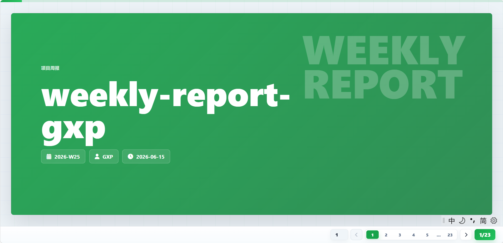
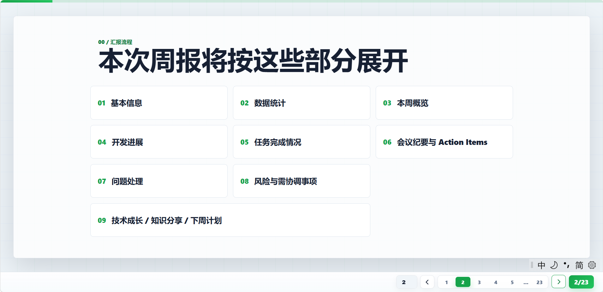
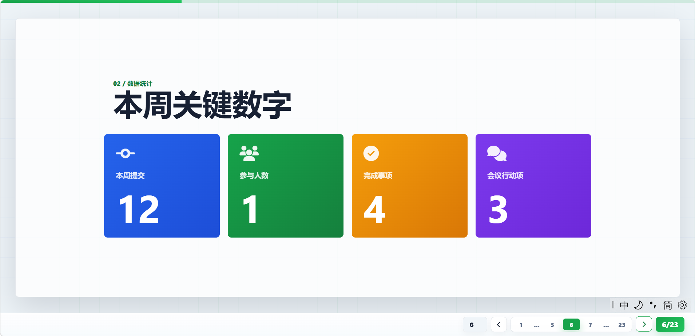
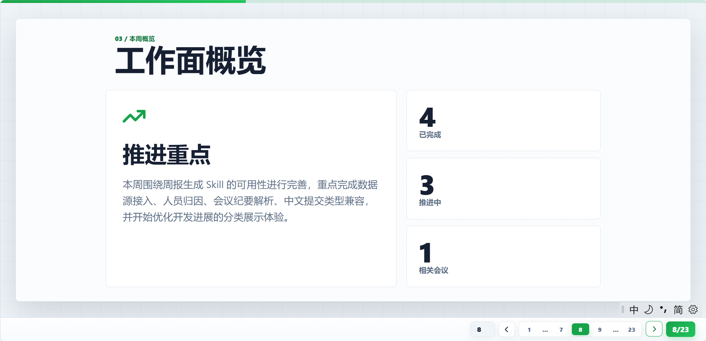
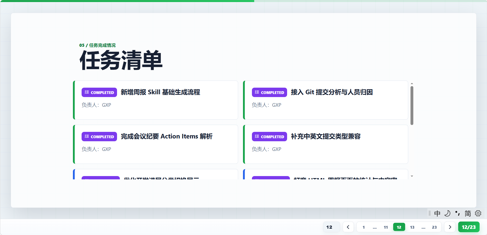
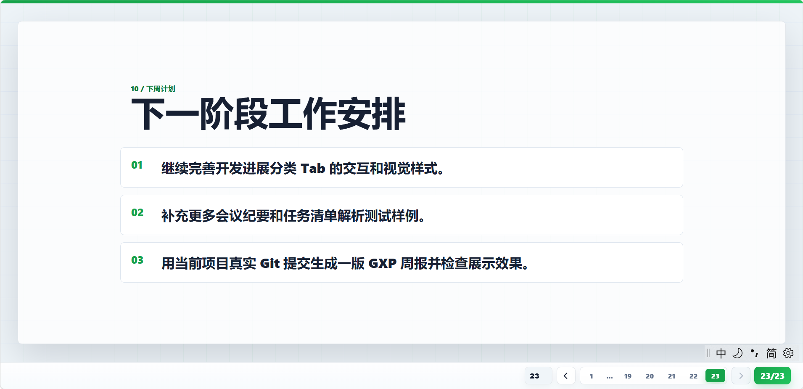

# weekly-report-gxp

`weekly-report-gxp` 是一个面向技术人员的自动化周报生成 Skill，可用于 Codex、Claude Code 等 AI 编程助手，能够整合 Git 提交、任务清单、由腾讯会议/豆包等工具自动生成的会议纪要，以及手工补充内容，生成适合演示汇报的 HTML 周报。

它适合这样的场景：

* 个人周报：指定 小明、小红等人员，只生成该成员相关内容。

* 团队周报：汇总多人 Git 提交、任务、会议行动项和风险。

* 技术汇报：输出横向 slide deck 风格页面，适合浏览器打开后投屏讲解。

当前版本输出 HTML进行演示。

## 界面预览

生成结果是一个横向翻页的周报页面，支持按钮、页码、键盘和触屏切换。

| 页面   | 预览                                                                                  |
| ---- | ----------------------------------------------------------------------------------- |
| 报告封面 |  |
| 演示概览 |  |
| 数据统计 |  |
| 工作概览 |  |
| 开发进展 |  |
| 任务情况 |  |
| 任务详情 |  |
| 问题点 |  |
| 技术收获 |  |
| 下周计划 |  |
| 下周事项 |  |

## 功能特点

* 从 Git log 自动提取提交人、提交时间、提交类型和提交标题。

* 支持 `feat/fix/docs` 等英文提交类型，也支持 `新增/bug/文档` 等中文类型。

* 通过 `members.json` 把 Git author、邮箱、简称、`@提及` 统一映射到真实人员。

* 从 `todo.md`、`issues.md` 或 `tasks.json` 提取完成、进行中、待办任务。

* 从 `meeting-notes.md` 或 `meetings/*.md` 提取会议结论、参会人、Action Items 和风险。

* 从 `user-input.json` 或独立 Markdown/JSON 文件补充问题、风险、成长、知识分享和下周计划。

* 开发进展支持按分类统计和点击切换。

## 输入文件

所有输入文件放在被分析项目根目录，也就是 `--project-dir` 指向的目录。

### members.json

用于把 Git 提交作者、邮箱、简称、会议或任务中的 `@提及` 映射为同一个人。

```json
{
  "members": [
    {
      "name": "GXP",
      "aliases": [
        "GXP",
        "G_xps",
        "494853604@qq.com",
        "67566989+G-xps@users.noreply.github.com",
        "@GXP"
      ]
    }
  ]
}
```

### todo.md

用于生成数据统计、本周概览、任务完成情况和开发进展中的任务项。

```markdown
## 已完成
- [x] @GXP 新增周报 Skill 基础生成流程
- [x] @GXP 接入 Git 提交分析与人员归因

## 进行中
- [ ] @GXP 优化开发进展分类切换展示

## 待办
- [ ] @GXP 补充更多真实项目输入样例
```

### meeting-notes.md

用于生成会议纪要、会议行动项、相关会议数量和会议风险。

```markdown
# 周报生成器功能评审

日期：2026-06-15
参会人：GXP

## 结论
- 周报生成器保留 Git、任务、会议纪要和手工补充内容四类数据源。

## Action Items
- [x] @GXP 造一组 GXP 的任务、会议、问题、风险、成长和知识分享数据
- [ ] @GXP 将开发进展改成按分类统计并可点击切换

## 风险
- 真实提交信息如果没有规范前缀，开发进展分类会落入 other。
```

### user-input.json

用于补充 Git 和任务无法表达的内容。

```json
{
  "project_name": "weekly-report-gxp",
  "reporter": "GXP",
  "summary": "本周围绕周报生成 Skill 的可用性进行完善。",
  "problems": [],
  "growth": [],
  "knowledge": [],
  "risks": [],
  "next_plans": []
}
```

也可以用独立文件替代部分字段：

* `problems.md` / `problems.json`

* `growth.md` / `growth.json`

* `knowledge.md` / `knowledge.json`

* `risks.md` / `risks.json`

* `next-plans.md` / `next-plans.json`

## Git 提交规范

提交信息推荐写成：

```text
类型: 提交说明
```

支持英文类型和中文别名：

| 类型         | 中文含义     | 适合写什么                   |
| ---------- | -------- | ----------------------- |
| `feat`     | 新增       | 新增能力、新页面、新接口、新脚本        |
| `fix`      | bug / 修复 | 修 bug、修异常、修错误逻辑         |
| `docs`     | 文档       | README、说明文档、注释文档        |
| `style`    | 代码       | 格式化、空格、命名微调，不影响逻辑       |
| `refactor` | 重构       | 调整代码结构，但不改变功能           |
| `perf`     | 优化       | 提速、减少内存、优化查询            |
| `test`     | 测试       | 新增或修改测试用例               |
| `chore`    | 运维       | 依赖、配置、构建脚本、工具调整         |
| `build`    | 构建       | 打包配置、构建流程、构建依赖          |
| `ci`       | CI/CD    | GitHub Actions、流水线、自动部署 |

示例：

```text
新增: 支持会议纪要 Action Items 解析
bug: 修复任务文件重复读取
文档: 补充输入格式说明
重构: 拆分数据聚合逻辑
优化: 提升 Git 日志解析速度
测试: 添加个人周报生成样例
```

## 周报结构

默认生成这些页面：

1. 报告封面
2. 演示概览
3. 基本信息
4. 数据统计
5. 本周概览
6. 开发进展
7. 任务完成情况
8. 会议纪要与 Action Items
9. 问题处理
10. 风险与需协调事项
11. 技术成长 / 知识分享
12. 下周计划

## 目录说明

```text
weekly-report-gxp/
  SKILL.md                  Skill 入口说明
  scripts/                  数据采集、聚合、渲染脚本
  references/               输入格式、数据结构和周报结构说明
  assets/                   HTML 模板、样式和样例输入
  ui/                       生成界面截图
  examples/sample-project/  示例项目输入文件
```

##
